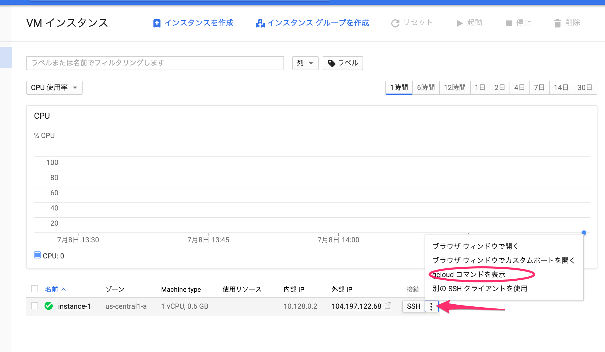

# Startup/Shutdown Script

ビルド用仮想マシンが起動したときにと終了したときに実行されるスクリプトです。

## 説明

### メタデータ

メタデータとして以下のデータを期待します。

 - gh-event: 発生した pull request の json 文字列です。
 - gh_oauth_token: GitHub API を呼び出すためのトークンです
 - aws_credentials: AWS の API を呼び出すための認証情報です


### startup script

ビルド用仮想マシンは起動をしたときメタデータの `startup-script` にこのファイル `startup.rb` を指定することで起動時に実行できます。このスクリプトは

 - ソースコードのビルド結果を格納する場所の作成
 - ビルド結果を格納する Google Cloud Storage のマウント
 - ソースコードの取得(TODO)
 - ビルドステータスを `pending` へ変更
 - ビルド(TODO)
 - ビルド結果を `/opt/build_state` に保存
 - 自分自身のシャットダウン

を行います。

### shutdwon script

起動をした時のメタデータに `shutdown-scirpt` に `shutdown.rb` を指定することで実行されます。

 - `/opt/build_state`のビルド結果を使ってビルドステータスの変更

実行環境には Ruby が必要です。

## テスト方法

事前に

 - [vagrant](https://www.vagrantup.com/)
 - [vagrant-google](https://github.com/mitchellh/vagrant-google)
 - [gloud](https://cloud.google.com/sdk/gcloud/)

 をインストールします。

## Vagrant の初期設定

以下のコマンドを実行します

    vagrant box add gce https://github.com/mitchellh/vagrant-google/raw/master/google.box

## GCP アクセスキーを用意する

Dropbox: projects/rocket-ci/virtualmachine/scripts/cred からサービスアカウントの鍵ファイルをダウンロードして、 `cred` に配置します。


```
cred
└── rocket-ci-7a179946404e.json
```

## SSH の初期設定

### 公開鍵/秘密鍵 を作る

一旦[GCPのコンソール](https://console.cloud.google.com/compute/instances?project=rocket-ci&graph=GCE_CPU&duration=PT1H)から仮想マシンインスタンスを作ります。コンソールから `gcloud コマンドを表示` を選び、実行します。



このコマンドを実行すると `${HOME}/.ssh` 以下に GCP で利用をするためのSSH公開鍵/秘密鍵が作られます。ファイルが作られていることを確認したら、この仮装マシンインスタンスは削除をします。

### SSH設定ファイルを作る

`config/ssh.rb` ファイルを作り、

```ruby
def ssh_config(ssh)
  ssh.username = "<username>" #SSH にログインをするユーザー名
  ssh.private_key_path = "<ssh key file path>" #SSHにログインをするときの private key file のパス
end
```

を記入します。

## 仮想マシンの実行

    vagrant up --provider=google --provision
    vagrant ssh

## スクリプトの実行

`Vagrant` を使って仮想マシンを立ち上げると `/vagrant/startup.rb` にスクリプトが配置されるので、実行できます。

また、デバッグ用のオプションとして `/vagrant/startup.rb D` とすると、デバッグモードとなり、シャットダウンを防ぐことなどが可能です。

## 仮想マシンの終了

作業が終わったときは次のコマンドで仮想マシンインスタンスを終了します。

    vagrant destroy -f
    